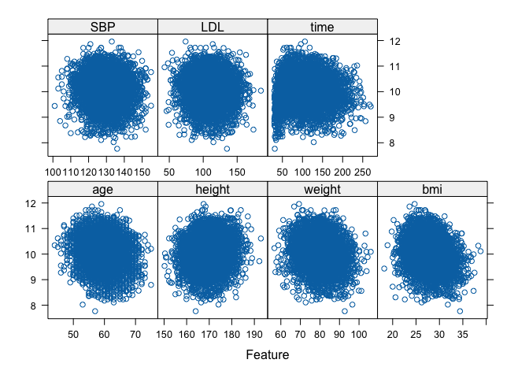
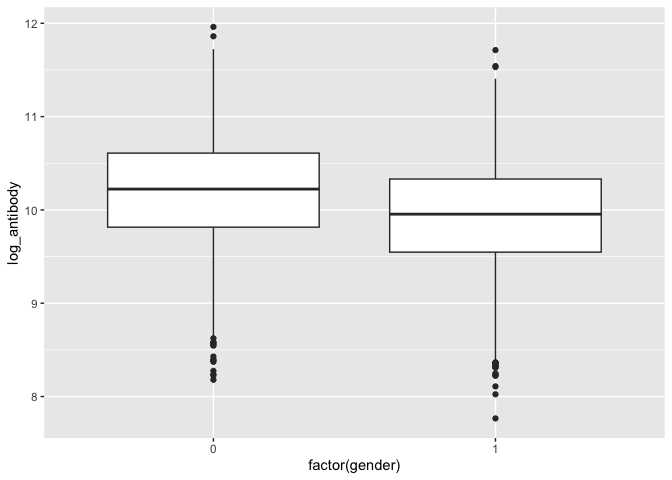
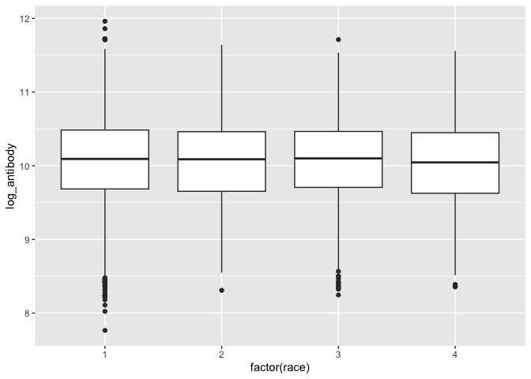
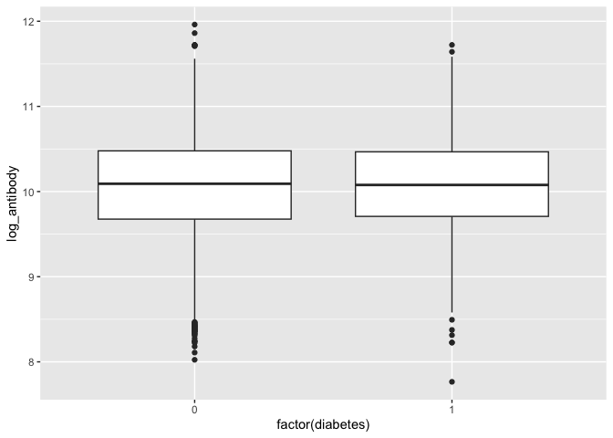
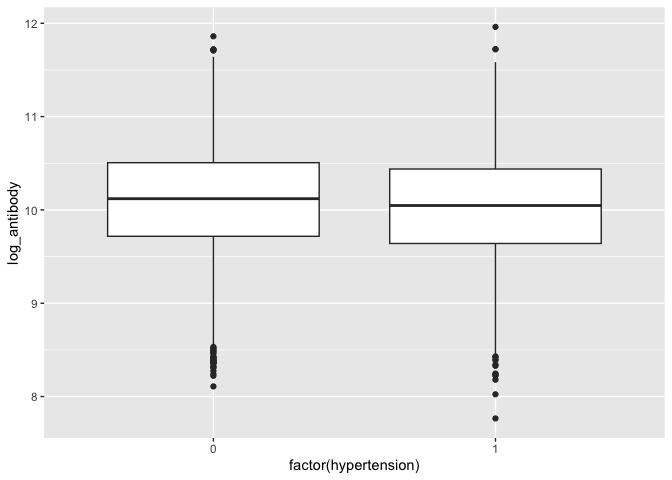
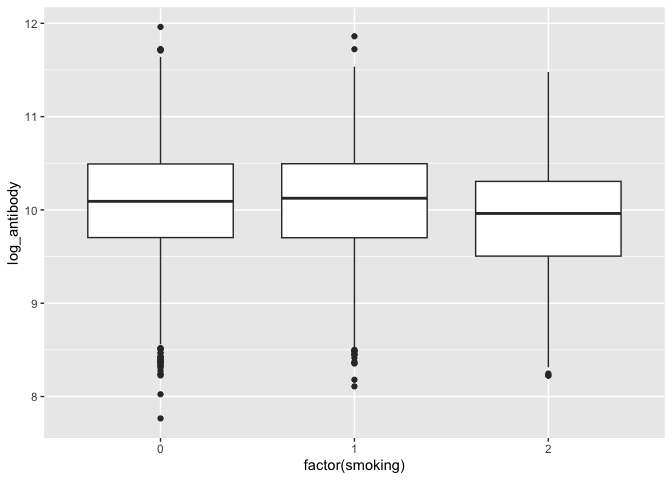
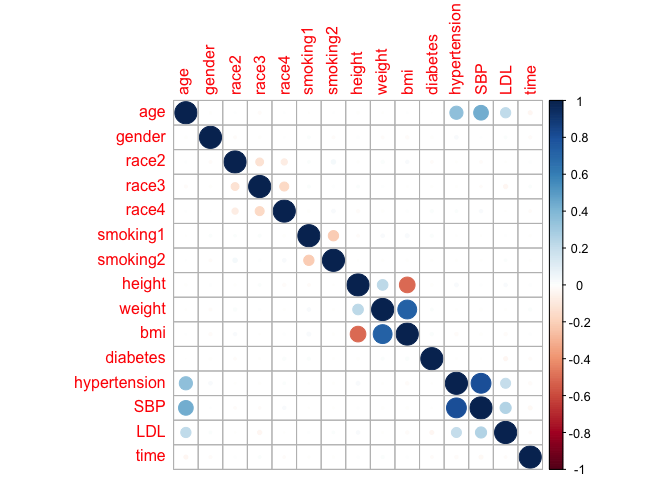
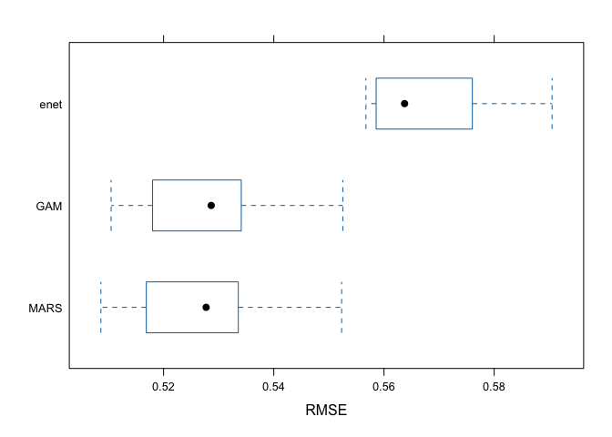

DS2_midterm
================
My An Huynh, Soomin You
2025-03-26

``` r
library(tidyverse)
```

    ## ── Attaching core tidyverse packages ──────────────────────── tidyverse 2.0.0 ──
    ## ✔ dplyr     1.1.4     ✔ readr     2.1.5
    ## ✔ forcats   1.0.0     ✔ stringr   1.5.1
    ## ✔ ggplot2   3.5.1     ✔ tibble    3.2.1
    ## ✔ lubridate 1.9.4     ✔ tidyr     1.3.1
    ## ✔ purrr     1.0.4     
    ## ── Conflicts ────────────────────────────────────────── tidyverse_conflicts() ──
    ## ✖ dplyr::filter() masks stats::filter()
    ## ✖ dplyr::lag()    masks stats::lag()
    ## ℹ Use the conflicted package (<http://conflicted.r-lib.org/>) to force all conflicts to become errors

``` r
library(MASS)
```

    ## 
    ## Attaching package: 'MASS'
    ## 
    ## The following object is masked from 'package:dplyr':
    ## 
    ##     select

``` r
library(caret)
```

    ## Loading required package: lattice
    ## 
    ## Attaching package: 'caret'
    ## 
    ## The following object is masked from 'package:purrr':
    ## 
    ##     lift

``` r
library(corrplot)
```

    ## corrplot 0.95 loaded

``` r
library(pROC)
```

    ## Type 'citation("pROC")' for a citation.
    ## 
    ## Attaching package: 'pROC'
    ## 
    ## The following objects are masked from 'package:stats':
    ## 
    ##     cov, smooth, var

``` r
library(mgcv)
```

    ## Loading required package: nlme
    ## 
    ## Attaching package: 'nlme'
    ## 
    ## The following object is masked from 'package:dplyr':
    ## 
    ##     collapse
    ## 
    ## This is mgcv 1.9-1. For overview type 'help("mgcv-package")'.

## Load Data

``` r
load("data/dat1.RData")
load("data/dat2.RData")
```

## Summary Statistics

## Exploratory Data Analysis

``` r
train = dat1 |>
  dplyr::select(-id)


test = dat2 |> 
  dplyr::select(-id)

train2 = dat1 |> 
  dplyr::select(-id) |>
  mutate(
    gender = as.numeric(gender), 
    race = as.numeric(race), 
    smoking = as.numeric(smoking), 
    diabetes = as.numeric(diabetes)
  )
  

x = model.matrix(log_antibody ~ ., data = train)[, -1]
y = train$log_antibody

x2 = model.matrix(log_antibody ~ ., data = train2)[, -1]
y2 = train2$log_antibody

featurePlot(x = train[, -c(2,3,4,8,9, 13)], y = train$log_antibody, plot = "scatter")
```

<!-- -->

``` r
#  boxplot for factor/binary variables 
ggplot(aes(x = factor(gender), y = log_antibody), data = train) + 
  geom_boxplot()
```

<!-- -->

``` r
ggplot(aes(x = factor(race), y = log_antibody), data = train) + 
  geom_boxplot()
```

<!-- -->

``` r
ggplot(aes(x = factor(race), y = log_antibody), data = train) + 
  geom_boxplot()
```

<!-- -->

``` r
ggplot(aes(x = factor(diabetes), y = log_antibody), data = train) + 
  geom_boxplot()
```

<!-- -->

``` r
ggplot(aes(x = factor(hypertension), y = log_antibody), data = train) + 
  geom_boxplot()
```

<!-- -->

``` r
ggplot(aes(x = factor(smoking), y = log_antibody), data = train) + 
  geom_boxplot()
```

<!-- -->

``` r
corrplot(cor(x), method = "circle", type = "full")
```

<!-- -->

## Model training

1)  elastic net  

2)  MARS

3)  PCR

4)  GAM

5)  smoothing splines

``` r
set.seed(1)
ctrl1 = trainControl(method = "cv", number = 10)

gam_mod = train(x = x, 
                y = y, 
                method = "gam", 
                trControl = ctrl1)

gam_mod$bestTune
```

    ##   select method
    ## 2   TRUE GCV.Cp

``` r
gam_mod$finalModel
```

    ## 
    ## Family: gaussian 
    ## Link function: identity 
    ## 
    ## Formula:
    ## .outcome ~ gender + race2 + race3 + race4 + smoking1 + smoking2 + 
    ##     diabetes + hypertension + s(age) + s(SBP) + s(LDL) + s(bmi) + 
    ##     s(time) + s(height) + s(weight)
    ## 
    ## Estimated degrees of freedom:
    ## 0.991 0.000 0.000 4.179 7.892 1.234 0.000 
    ##  total = 23.3 
    ## 
    ## GCV score: 0.2786734

``` r
summary(gam_mod)
```

    ## 
    ## Family: gaussian 
    ## Link function: identity 
    ## 
    ## Formula:
    ## .outcome ~ gender + race2 + race3 + race4 + smoking1 + smoking2 + 
    ##     diabetes + hypertension + s(age) + s(SBP) + s(LDL) + s(bmi) + 
    ##     s(time) + s(height) + s(weight)
    ## 
    ## Parametric coefficients:
    ##               Estimate Std. Error t value Pr(>|t|)    
    ## (Intercept)  10.228177   0.015328 667.269  < 2e-16 ***
    ## gender       -0.297837   0.014933 -19.945  < 2e-16 ***
    ## race2        -0.003296   0.033009  -0.100    0.920    
    ## race3        -0.010509   0.018837  -0.558    0.577    
    ## race4        -0.037424   0.026176  -1.430    0.153    
    ## smoking1      0.022219   0.016660   1.334    0.182    
    ## smoking2     -0.193175   0.025834  -7.478  8.9e-14 ***
    ## diabetes      0.014230   0.020640   0.689    0.491    
    ## hypertension -0.007678   0.015995  -0.480    0.631    
    ## ---
    ## Signif. codes:  0 '***' 0.001 '**' 0.01 '*' 0.05 '.' 0.1 ' ' 1
    ## 
    ## Approximate significance of smooth terms:
    ##                 edf Ref.df      F p-value    
    ## s(age)    9.908e-01      9 13.733  <2e-16 ***
    ## s(SBP)    6.175e-07      9  0.000   0.765    
    ## s(LDL)    6.648e-07      9  0.000   0.639    
    ## s(bmi)    4.179e+00      9 41.897  <2e-16 ***
    ## s(time)   7.892e+00      9 44.960  <2e-16 ***
    ## s(height) 1.234e+00      9  0.278   0.121    
    ## s(weight) 2.262e-06      9  0.000   0.666    
    ## ---
    ## Signif. codes:  0 '***' 0.001 '**' 0.01 '*' 0.05 '.' 0.1 ' ' 1
    ## 
    ## R-sq.(adj) =   0.22   Deviance explained = 22.4%
    ## GCV = 0.27867  Scale est. = 0.27738   n = 5000

``` r
set.seed(1)
enet_mod = train(log_antibody ~ ., 
                 data = train,
                 method = "glmnet", 
                 tuneGrid = expand.grid(alpha = seq(0, 1, length = 21), 
                                        lambda = exp(seq(6, 0, length = 100))),
                 trControl = ctrl1)
```

    ## Warning in nominalTrainWorkflow(x = x, y = y, wts = weights, info = trainInfo,
    ## : There were missing values in resampled performance measures.

``` r
enet_mod$bestTune
```

    ##   alpha lambda
    ## 1     0      1

``` r
set.seed(1)
mars_mod = train(x = x, 
                 y = y, 
                 method = "earth", 
                 trControl = ctrl1)
```

    ## Loading required package: earth

    ## Loading required package: Formula

    ## Loading required package: plotmo

    ## Loading required package: plotrix

``` r
summary(mars_mod)
```

    ## Call: earth(x=matrix[5000,15], y=c(10.65,9.889,1...), keepxy=TRUE, degree=1,
    ##             nprune=9)
    ## 
    ##             coefficients
    ## (Intercept)   10.8474469
    ## gender        -0.2962905
    ## smoking2      -0.2051269
    ## h(59-age)      0.0161385
    ## h(age-59)     -0.0229576
    ## h(bmi-23.7)   -0.0843802
    ## h(27.8-bmi)   -0.0619974
    ## h(57-time)    -0.0335293
    ## h(time-57)    -0.0022542
    ## 
    ## Selected 9 of 10 terms, and 5 of 15 predictors (nprune=9)
    ## Termination condition: RSq changed by less than 0.001 at 10 terms
    ## Importance: bmi, gender, time, age, smoking2, race2-unused, race3-unused, ...
    ## Number of terms at each degree of interaction: 1 8 (additive model)
    ## GCV 0.2787787    RSS 1384.431    GRSq 0.2166152    RSq 0.2216218

## Model validation

6)  comparison

``` r
bwplot(resamples(list(MARS = mars_mod, 
                      GAM = gam_mod,
                      enet = enet_mod)),
       metric = "RMSE")
```

<!-- -->

## Conclusion
