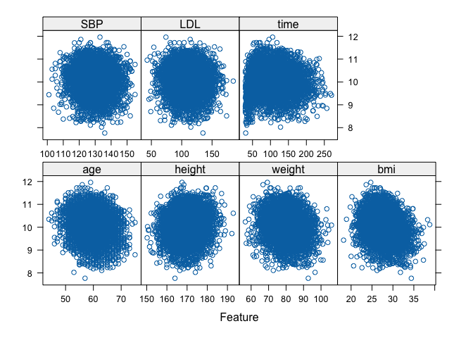
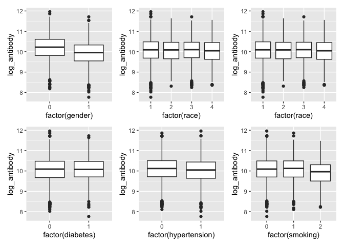
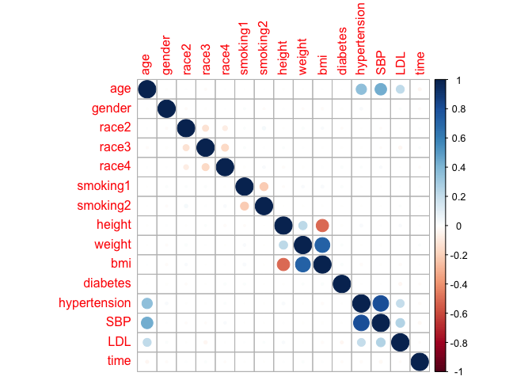
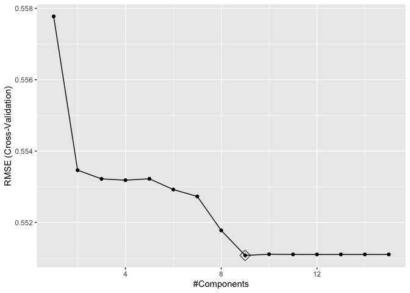
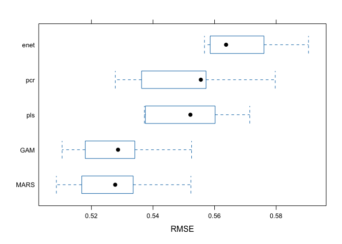

DS2_midterm
================
My An Huynh, Soomin You
2025-03-27

``` r
library(tidyverse)
```

    ## ── Attaching core tidyverse packages ──────────────────────── tidyverse 2.0.0 ──
    ## ✔ dplyr     1.1.4     ✔ readr     2.1.5
    ## ✔ forcats   1.0.0     ✔ stringr   1.5.1
    ## ✔ ggplot2   3.5.1     ✔ tibble    3.2.1
    ## ✔ lubridate 1.9.4     ✔ tidyr     1.3.1
    ## ✔ purrr     1.0.2     
    ## ── Conflicts ────────────────────────────────────────── tidyverse_conflicts() ──
    ## ✖ dplyr::filter() masks stats::filter()
    ## ✖ dplyr::lag()    masks stats::lag()
    ## ℹ Use the conflicted package (<http://conflicted.r-lib.org/>) to force all conflicts to become errors

``` r
library(MASS)
```

    ## 
    ## Attaching package: 'MASS'
    ## 
    ## The following object is masked from 'package:dplyr':
    ## 
    ##     select

``` r
library(caret)
```

    ## Loading required package: lattice
    ## 
    ## Attaching package: 'caret'
    ## 
    ## The following object is masked from 'package:purrr':
    ## 
    ##     lift

``` r
library(corrplot)
```

    ## corrplot 0.95 loaded

``` r
library(mgcv)
```

    ## Loading required package: nlme
    ## 
    ## Attaching package: 'nlme'
    ## 
    ## The following object is masked from 'package:dplyr':
    ## 
    ##     collapse
    ## 
    ## This is mgcv 1.9-1. For overview type 'help("mgcv-package")'.

``` r
library(patchwork)
```

    ## 
    ## Attaching package: 'patchwork'
    ## 
    ## The following object is masked from 'package:MASS':
    ## 
    ##     area

## Load Data

``` r
load("data/dat1.RData")
load("data/dat2.RData")
```

## Summary Statistics

## Exploratory Data Analysis

``` r
#train data 
train = dat1 |>
  dplyr::select(-id)

x = model.matrix(log_antibody ~ ., data = train)[, -1]
y = train$log_antibody

#test data 
test = dat2 |> 
  dplyr::select(-id)

x_test = model.matrix(log_antibody ~ ., data = test)[, -1]
y_test = train$log_antibody

# visualization of the train data 
featurePlot(x = train[, -c(2,3,4,8,9, 13)], y = train$log_antibody, plot = "scatter")
```

<!-- -->

``` r
# boxplot for factor/binary variables 
p1 = ggplot(aes(x = factor(gender), y = log_antibody), data = train) + 
  geom_boxplot()
p2 = ggplot(aes(x = factor(race), y = log_antibody), data = train) + 
  geom_boxplot()
p3 = ggplot(aes(x = factor(race), y = log_antibody), data = train) + 
  geom_boxplot()
p4 = ggplot(aes(x = factor(diabetes), y = log_antibody), data = train) + 
  geom_boxplot()
p5 = ggplot(aes(x = factor(hypertension), y = log_antibody), data = train) + 
  geom_boxplot()
p6 = ggplot(aes(x = factor(smoking), y = log_antibody), data = train) + 
  geom_boxplot()
p1 + p2 + p3 + p4 + p5 + p6
```

<!-- -->

``` r
corrplot(cor(x), method = "circle", type = "full")
```

<!-- -->

Both the train data and the test data were loaded and separated into
response variable and predictor variable matrices. Scatterplots were
made for the numeric predictor variables and boxplots were made for the
factor or binary variables.

Correlation plot was also checked and no multicolinearity was observed.

## Model training

To find an optimal prediction model of antibody levels that show the
impact of the demographic and clinical factors, we decide to build
various models and compare. We use elastic net, MARS, GAM, PCR and PLS
models as shown below.

``` r
ctrl1 = trainControl(method = "cv", number = 10)

# elastic net 
set.seed(1)
enet_mod = train(log_antibody ~ ., 
                 data = train,
                 method = "glmnet", 
                 tuneGrid = expand.grid(alpha = seq(0, 1, length = 21), 
                                        lambda = exp(seq(6, 0, length = 100))),
                 trControl = ctrl1)
```

    ## Warning in nominalTrainWorkflow(x = x, y = y, wts = weights, info = trainInfo,
    ## : There were missing values in resampled performance measures.

``` r
enet_mod$bestTune
```

    ##   alpha lambda
    ## 1     0      1

Maybe describe how we determined the tuning grid range for lambda…?

``` r
# mars
set.seed(1)
mars_mod = train(x = x, 
                 y = y, 
                 method = "earth", 
                 trControl = ctrl1)
```

    ## Loading required package: earth

    ## Loading required package: Formula

    ## Loading required package: plotmo

    ## Loading required package: plotrix

``` r
summary(mars_mod)
```

    ## Call: earth(x=matrix[5000,15], y=c(10.65,9.889,1...), keepxy=TRUE, degree=1,
    ##             nprune=9)
    ## 
    ##             coefficients
    ## (Intercept)   10.8474469
    ## gender        -0.2962905
    ## smoking2      -0.2051269
    ## h(59-age)      0.0161385
    ## h(age-59)     -0.0229576
    ## h(bmi-23.7)   -0.0843802
    ## h(27.8-bmi)   -0.0619974
    ## h(57-time)    -0.0335293
    ## h(time-57)    -0.0022542
    ## 
    ## Selected 9 of 10 terms, and 5 of 15 predictors (nprune=9)
    ## Termination condition: RSq changed by less than 0.001 at 10 terms
    ## Importance: bmi, gender, time, age, smoking2, race2-unused, race3-unused, ...
    ## Number of terms at each degree of interaction: 1 8 (additive model)
    ## GCV 0.2787787    RSS 1384.431    GRSq 0.2166152    RSq 0.2216218

``` r
# gam  
set.seed(1)
gam_mod = train(x = x, 
                y = y, 
                method = "gam", 
                trControl = ctrl1)

gam_mod$bestTune
```

    ##   select method
    ## 2   TRUE GCV.Cp

``` r
gam_mod$finalModel
```

    ## 
    ## Family: gaussian 
    ## Link function: identity 
    ## 
    ## Formula:
    ## .outcome ~ gender + race2 + race3 + race4 + smoking1 + smoking2 + 
    ##     diabetes + hypertension + s(age) + s(SBP) + s(LDL) + s(bmi) + 
    ##     s(time) + s(height) + s(weight)
    ## 
    ## Estimated degrees of freedom:
    ## 0.991 0.000 0.000 4.179 7.892 1.234 0.000 
    ##  total = 23.3 
    ## 
    ## GCV score: 0.2786734

``` r
summary(gam_mod)
```

    ## 
    ## Family: gaussian 
    ## Link function: identity 
    ## 
    ## Formula:
    ## .outcome ~ gender + race2 + race3 + race4 + smoking1 + smoking2 + 
    ##     diabetes + hypertension + s(age) + s(SBP) + s(LDL) + s(bmi) + 
    ##     s(time) + s(height) + s(weight)
    ## 
    ## Parametric coefficients:
    ##               Estimate Std. Error t value Pr(>|t|)    
    ## (Intercept)  10.228177   0.015328 667.269  < 2e-16 ***
    ## gender       -0.297837   0.014933 -19.945  < 2e-16 ***
    ## race2        -0.003296   0.033009  -0.100    0.920    
    ## race3        -0.010509   0.018837  -0.558    0.577    
    ## race4        -0.037424   0.026176  -1.430    0.153    
    ## smoking1      0.022219   0.016660   1.334    0.182    
    ## smoking2     -0.193175   0.025834  -7.478  8.9e-14 ***
    ## diabetes      0.014230   0.020640   0.689    0.491    
    ## hypertension -0.007678   0.015995  -0.480    0.631    
    ## ---
    ## Signif. codes:  0 '***' 0.001 '**' 0.01 '*' 0.05 '.' 0.1 ' ' 1
    ## 
    ## Approximate significance of smooth terms:
    ##                 edf Ref.df      F p-value    
    ## s(age)    9.908e-01      9 13.733  <2e-16 ***
    ## s(SBP)    6.175e-07      9  0.000   0.765    
    ## s(LDL)    6.648e-07      9  0.000   0.639    
    ## s(bmi)    4.179e+00      9 41.897  <2e-16 ***
    ## s(time)   7.892e+00      9 44.960  <2e-16 ***
    ## s(height) 1.234e+00      9  0.278   0.121    
    ## s(weight) 2.262e-06      9  0.000   0.666    
    ## ---
    ## Signif. codes:  0 '***' 0.001 '**' 0.01 '*' 0.05 '.' 0.1 ' ' 1
    ## 
    ## R-sq.(adj) =   0.22   Deviance explained = 22.4%
    ## GCV = 0.27867  Scale est. = 0.27738   n = 5000

``` r
# pcr model 
pcr_mod = train(x = x,
                y = y, 
                method = "pcr", 
                tuneGrid = data.frame(ncomp = 1:15), 
                trControl = ctrl1, 
                preProcess = c("center", "scale"))
summary(pcr_mod)
```

    ## Data:    X dimension: 5000 15 
    ##  Y dimension: 5000 1
    ## Fit method: svdpc
    ## Number of components considered: 15
    ## TRAINING: % variance explained
    ##           1 comps  2 comps  3 comps  4 comps  5 comps  6 comps  7 comps
    ## X         14.7806   26.705   34.940   43.041   50.762   57.973    64.72
    ## .outcome   0.7693    5.726    6.167    6.299    6.328    6.436    10.07
    ##           8 comps  9 comps  10 comps  11 comps  12 comps  13 comps  14 comps
    ## X           71.44    77.92     83.82     89.18     94.01     98.71     99.99
    ## .outcome    10.35    12.63     12.65     12.85     12.86     14.38     14.40
    ##           15 comps
    ## X           100.00
    ## .outcome     15.13

``` r
set.seed(1)
# pls model 
pls_mod = train(x = x,
                y = y, 
                method = "pls", 
                tuneGrid = data.frame(ncomp = 1:15), 
                trControl = ctrl1, 
                preProcess = c("center", "scale"))
summary(pls_mod)
```

    ## Data:    X dimension: 5000 15 
    ##  Y dimension: 5000 1
    ## Fit method: oscorespls
    ## Number of components considered: 9
    ## TRAINING: % variance explained
    ##           1 comps  2 comps  3 comps  4 comps  5 comps  6 comps  7 comps
    ## X           10.77    19.88    31.77    38.37    43.94    47.54    53.19
    ## .outcome    12.83    14.29    14.38    14.41    14.42    14.45    14.51
    ##           8 comps  9 comps
    ## X           54.88    60.39
    ## .outcome    15.03    15.13

``` r
# test error 
pred_pls = predict(pls_mod, newdata = x_test)
mean((y_test - pred_pls)^2)
```

    ## [1] 0.4143388

``` r
ggplot(pls_mod, highlight = TRUE)
```

<!-- -->

## Model validation

6)  comparison

``` r
resamp = resamples(list(enet = enet_mod, 
                        MARS = mars_mod, 
                        GAM = gam_mod,
                        pcr = pcr_mod, 
                        pls = pls_mod))
summary(resamp)
```

    ## 
    ## Call:
    ## summary.resamples(object = resamp)
    ## 
    ## Models: enet, MARS, GAM, pcr, pls 
    ## Number of resamples: 10 
    ## 
    ## MAE 
    ##           Min.   1st Qu.    Median      Mean   3rd Qu.      Max. NA's
    ## enet 0.4407271 0.4480526 0.4521692 0.4524701 0.4541075 0.4750379    0
    ## MARS 0.4033817 0.4179151 0.4234065 0.4221856 0.4275553 0.4418075    0
    ## GAM  0.4042397 0.4194058 0.4242789 0.4228546 0.4275021 0.4421737    0
    ## pcr  0.4196351 0.4313311 0.4386728 0.4393661 0.4419395 0.4640728    0
    ## pls  0.4205572 0.4324090 0.4404365 0.4392051 0.4454607 0.4596797    0
    ## 
    ## RMSE 
    ##           Min.   1st Qu.    Median      Mean   3rd Qu.      Max. NA's
    ## enet 0.5567203 0.5593407 0.5637393 0.5677031 0.5737537 0.5905104    0
    ## MARS 0.5086158 0.5180140 0.5277205 0.5277239 0.5330971 0.5523110    0
    ## GAM  0.5104739 0.5194562 0.5286409 0.5286279 0.5334558 0.5525356    0
    ## pcr  0.5277512 0.5379850 0.5555384 0.5513049 0.5569723 0.5796981    0
    ## pls  0.5372125 0.5386023 0.5521459 0.5510768 0.5588196 0.5714301    0
    ## 
    ## Rsquared 
    ##            Min.   1st Qu.    Median      Mean   3rd Qu.      Max. NA's
    ## enet 0.08772644 0.1219076 0.1356731 0.1358434 0.1609589 0.1719591    0
    ## MARS 0.16452631 0.2016386 0.2149715 0.2179857 0.2395080 0.2656206    0
    ## GAM  0.16168005 0.1988396 0.2126428 0.2152374 0.2350941 0.2640126    0
    ## pcr  0.08724592 0.1226572 0.1530365 0.1467835 0.1683141 0.1916469    0
    ## pls  0.08861598 0.1403744 0.1493405 0.1476804 0.1609204 0.1975762    0

``` r
bwplot(resamp, metric = "RMSE")
```

<!-- -->

## Conclusion

our best model is MARS since it has th elowest mean RMSE value.
